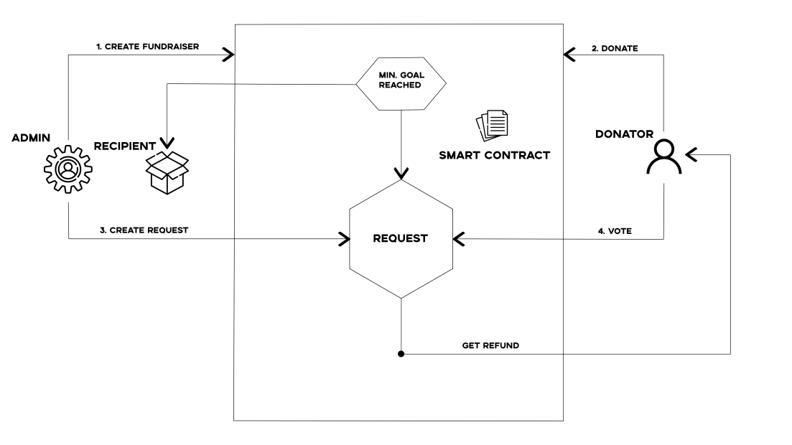

Feel free to check out [deployed version](https://3327.radojevic.rs)

# Decentralized Donation Application on Ethereum

This project aims to implement basic functionalities of a donation platform using Ethereum.

## Why DApp?

The main advantage in this case provided by decentralized applications is certainly transparency. The on-chain nature of
a DApp allows everyone to inspect the code and be more sure about its function. Any interaction with the DApp will be
stored forever in the blockchain.

## Requirements

The Donation DApp allows the admin (foundation owner) and registered organizations to create a donation campaign. Once the campaign is created, it is
available to receive donations. Donations are accepted in ETH and ERC20 tokens. The token exchange is done via V2 Uniswap DEX. Organizations can specify which cryptocurrency to receive from the whitelist. Organizers can expand the list of tokens. Also, for each donation, donors can take NFT as a reward. If the minimum goal is met, after the deadline (if any) the money is forwarded to the
recipient. If the minimum goal is not reached, donors can refund funds.

The main components of our Auction DApp are:

* A smart contract that represents a repository of campaigns and allows them to be created

* A smart contract that represents NFT

* A smart contract for token swap

* A web frontend using the [Svelte](https://svelte.dev/) framework

* The web3.js library to connect to Ethereum chains (via MetaMask)



### Auction DApp: Backend Smart Contracts

Our Donation DApp is supported by two smart contracts that we need to deploy on an Ethereum blockchain in order to
support the application: SupportChildren and Award. As mentioned, smart contracts are used for the business logic of
the application(donations, contributions, refund and transfer of raised amount, rewarding).

#### SupportChildren

Represents a repository for created campaigns and contains functions for retrieving created campaigns and creating new
ones. In this way, each campaign is available and saved on the blockchain. It provides key functionalities such as:

* Creating campaigns
* Contributing to the campaigns
* Making payments
* Refunding if minimal goal is not met
* Redirecting funds if minimal goal is not met

This contract is too long to include here in full, but the interface of the contract, data structures and events
is presented. The entire contract is available in the
projects [GitHub](https://github.com/VodnikAngus/3327/contracts) repository.


----

```javascript

// SPDX-License-Identifier: MIT
// SPDX-License-Identifier: MIT
pragma solidity ^0.8.0;
pragma abicoder v2;

interface ISupportChildren {
    struct Campaign {
        string name;
        uint endTimestamp;
        address payable beneficiary;
        bool completed;
        uint goal;
        address cryptocurrency;
        string uri;
    }
    
    
    
    event CampaignCreated(uint campaignId, Campaign campaign);
    event Donation(string name, address indexed from, uint campaignId, uint amount, address tokenAddress, address beneficiary);
    event GoalReached(string name, uint campaignId, uint _raisedAmount, address beneficiary, address[] contributors);
    
   
    function isCompleted(uint _campaignId) external view returns(bool);
    function approve(address organization) external;     
    function isCampaignActive(uint _campaignId) external view returns(bool);
    function getCampaign(uint _campaignId) external view returns(Campaign memory);
    function getCampaigns() external view returns(Campaign[] memory);
    function newCurrency(address _token) external;
    function createCampaign(string memory name, address payable _beneficiary, uint _endTimestamp, uint _goal, address _cryptocurrency, string calldata uri) external;
    function donate(uint _campaignId, address _token, uint _amount) external;
    function donateETH(uint _campaignId) external payable;
    function finalPayment(uint _campaignId) external payable;
    function getRefund(uint _campaignId) external payable;
    
}

```

----

#### Swap 
Swap is a contract that exchanges tokens using the Uniswap V2 Router. The contract interface is shown here:

---- 
```javascript
// SPDX-License-Identifier: MIT
pragma solidity ^0.8.0;
pragma abicoder v2;
interface IUniswapV2Router {
  function getAmountsOut(uint256 amountIn, address[] memory path)
    external
    view
    returns (uint256[] memory amounts);
  
  function swapExactTokensForTokens(
  
    //amount of tokens we are sending in
    uint256 amountIn,
    //the minimum amount of tokens we want out of the trade
    uint256 amountOutMin,
    //list of token addresses we are going to trade in.  this is necessary to calculate amounts
    address[] calldata path,
    //this is the address we are going to send the output tokens to
    address to,
    //the last time that the trade is valid for
    uint256 deadline
  ) external returns (uint256[] memory amounts);
  
  function swapExactTokensForETHSupportingFeeOnTransferTokens(
  
    //amount of tokens we are sending in
    uint256 amountIn,
    //the minimum amount of tokens we want out of the trade
    uint256 amountOutMin,
    //list of token addresses we are going to trade in.  this is necessary to calculate amounts
    address[] calldata path,
    //this is the address we are going to send the output tokens to
    address to,
    //the last time that the trade is valid for
    uint256 deadline
  ) external payable ;

  function swapExactETHForTokensSupportingFeeOnTransferTokens(
    uint amountOutMin,
    address[] calldata path,
    address to,
    uint deadline
) external payable;
  
  
  
}

interface IUniswapV2Pair {
  function token0() external view returns (address);
  function token1() external view returns (address);
  function swap(
    uint256 amount0Out,
    uint256 amount1Out,
    address payable to,
    bytes calldata data
  ) external;
}

interface IUniswapV2Factory {
  function getPair(address token0, address token1) external returns (address);
}
```
----

#### Award
The award represents a simple implementation of the ERC721 token. Since we use the mainnet, we decided on the cheapest variant that will meet the needs of the task and provide suitable NFT users. The contract is represented here:

----

```javascript

// SPDX-License-Identifier: MIT
pragma solidity >=0.7.4;

import "@openzeppelin/contracts/token/ERC721/extensions/ERC721URIStorage.sol"; 
import "@openzeppelin/contracts/utils/Counters.sol";


contract Award is ERC721URIStorage {
    using Counters for Counters.Counter;
    Counters.Counter private _tokenIds;


    constructor(string memory _name, string memory _symbol)
    ERC721(_name, _symbol) {}

    function awardItem(address player, string memory tokenURI) public returns (uint256)

    {
        _tokenIds.increment();

        uint256 newItemId = _tokenIds.current();
        _mint(player, newItemId);
        _setTokenURI(newItemId, tokenURI);

        return newItemId;
    }
}
```

----


You can deploy these contracts to the Ethereum blockchain of your choice (e.g., Rinkeby) using Truffle in
the [smart-contracts](https://github.com/VodnikAngus/3327/smart-contracts) repository:

<pre data-type="programlisting">
$ <strong>truffle init</strong>
$ <strong>truffle compile</strong>
$ <strong>truffle migrate --network rinkeby</strong>
</pre>


In the implementation of the contract, the creator of the campaign has greater privileges than the donor in the sense
that only he allow which organization has the right to create.

### Auction DApp: Frontend User Interface
----

Once the Auction DApp’s contracts are deployed, you can interact with them using your JavaScript console and web3.js, or
another web3 library. However, most users will need an easy-to-use interface. Our Donation DApp user interface is built
using the Svelte framework.

You can start the application in frontend folder with:

<pre data-type="programlisting">
$ <strong>npm i</strong>
$ <strong>npm run dev</strong>
</pre>

The Donation DApp frontend will launch and will be accessible via any web browser at http://localhost:5000.


## Implementation/Data flow
----

#### 1. Creating a campaign with Fundraisings contract

Creating a campaign is a simple process of entering campaign details such as recipients, goals, currency, etc. Data is accessible to everyone so that donors can have a clear insight into who the money
will go to if the campaign is successful.

#### 2. Donations

Anyone can donate money at any time until the campaign is over. This is enabled by calling the donate/donateETH functions. The donate function is called when ERC20 tokens are donated, while donateETH is used for ETH donations.

#### 3.1 Goal/Minimal goal is reached/Final payment

If the goal is reached, the money is paid to the recipient immediately upon reaching it and the campaign is successfully
completed. In the second case, the deadline is waited and it is checked whether the minimum goal has been reached and in
that case the money is forwarded to the recipient and the campaign is also successfully completed.

#### 3.2 Minimal goal is not reached

If the minimum goal is not reached, donors can refund their funds.


### Mainnet deploying and testing the

For mainnet fork, you need to run the ganache-cli fork function using one of the providers (Alchemy, Infura, QuickNode), unlock the necessary accounts and perform a contract deploy. A test should be run in the smart contract folder.

<pre data-type="programlisting">
$ <strong>ganache-cli --fork #PROVIDER -u 0xb527a981e1d415af696936b3174f2d7ac8d11369 -u 0x50b42514389F25E1f471C8F03f6f5954df0204b0</strong>
$ <strong>truffle migrate --network mainnet_fork</strong>
$ <strong>npm run test</strong>
</pre>
